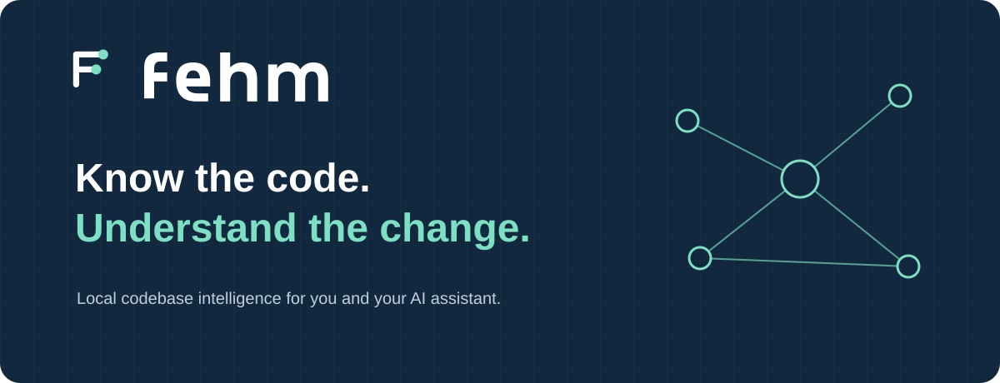

<p align="center">
  
</p>

<h1 align="center">Fehm</h1>

<p align="center">
  <a href="https://github.com/amirhamzakhan2001/fehm/actions/workflows/ci.yml"></a>
  <a href="LICENSE"></a>
  <a href="https://github.com/amirhamzakhan2001/fehm/pulls"></a>
  <a href="https://github.com/amirhamzakhan2001/fehm/releases"></a>
  <a href="https://github.com/amirhamzakhan2001/fehm/releases"></a>
</p>
<p align="center">
  <a href="src/"></a>
  <a href="python/"></a>
  <a href="#security-and-badge-status"></a>
  <a href="#security-and-badge-status"></a>
</p>

**Understand your codebase. Give your AI assistant better context. Review changes with evidence.**

Fehm builds a persistent local graph of your repository’s files, symbols and relationships. Explore it from the terminal, connect it to your coding assistant, or open the localhost cockpit. Use the same graph to assemble source context, inspect change impact and detect drift from your approved architecture and engineering practices.

Source scanning and ordinary graph queries run locally. Model-based features use a provider only when configured and invoked.

## Contents

- [Capabilities](#capabilities)
- [Get started](#get-started)
- [Connect your assistant](#connect-your-assistant)
- [Everyday workflows](#everyday-workflows)
- [Open-source foundations](#open-source-foundations)
- [Scope and limits](#scope-and-limits)
- [Build and contribute](#build-and-contribute)
- [Security and badge status](#security-and-badge-status)
- [Brand assets](#brand-assets)
- [Documentation](#documentation)
- [License](#license)

## Capabilities

Fehm’s features are grouped into ten connected workflows. The [feature guide](docs/FEATURES.md) explains their full scope and limits.

| Workflow | What you can do |
| --- | --- |
| **Understand the codebase** | Explore symbols, imports, callers, dependencies, entry points and execution paths, with source locations and relationship evidence. |
| **Build focused context** | Assemble relevant code, tests, architecture, decisions and history under an estimated token budget. Keep strong matches while giving related files space. |
| **Detect architecture drift** | Propose and approve project boundaries, inspect dependency violations and identify new violations as code changes. |
| **Maintain engineering practices** | Review 31 checks spanning development, testing, security, AI, delivery and operations. Choose required or advisory controls and compare evidence against a saved baseline. |
| **Review changes** | Inspect Git diffs and blast radius, run preflight checks, or invoke the bundled Open Code Review engine with repository context and source-linked findings. |
| **Verify behavior** | Select affected tests, execute supported project checks and use explicit mutation-testing or historical bug-replay workflows. |
| **Inspect quality and reliability** | Review dependency risk, dead code, security flows, coverage gaps, API compatibility, infrastructure and supplied runtime evidence. |
| **Engineer AI systems** | Analyze prompts and tool contracts, evaluate model behavior, compare models, optimize against held-out cases and retain evaluation evidence. |
| **Preserve project knowledge** | Explore ownership and history, retain decisions, generate onboarding notes and export linked Obsidian-compatible Markdown. |
| **Work across tools and projects** | Use the CLI, TypeScript library, MCP or local HTTP cockpit. Watch source changes and explore multiple indexed projects. |

## Get started

Install Fehm with **uv**. The platform-specific wheel contains the compiled engine and Open Code Review; a pinned dependency supplies its private Node runtime. End users do not need a separate npm or Node installation.

The current distribution workflow uses a supplied or locally built wheel. Replace the example path and `PLATFORM` with the actual wheel filename:

```bash
uv tool install /path/to/fehm-1.4.0-py3-none-PLATFORM.whl
uv tool update-shell
fehm --version

cd /absolute/path/to/your/project
fehm scan .
fehm query "authentication flow"
fehm serve .fehm/graph.json --watch
```

Open **http://127.0.0.1:7331** to explore the cockpit. Stop the server with Ctrl+C. Graph state is stored in `.fehm/` by default.

The repository’s release workflow has not yet published the public PyPI package. Use the wheel workflow above; `uv tool install fehm` is intended for the official registry release. See [installation, building and deployment](docs/DEPLOYMENT.md) for the complete steps.

Git workflows need Git, and executing your project’s tests or builds needs that project’s own toolchain. Fehm does not install project dependencies.

## Connect your assistant

After installing the CLI, choose a platform:

| Assistant | Registration command |
| --- | --- |
| Claude Code | `fehm install --platform claude` |
| Cursor | `fehm install --platform cursor` |
| Codex | `fehm install --platform codex` |
| Gemini CLI | `fehm install --platform gemini` |
| GitHub Copilot CLI | `fehm install --platform copilot` |
| VS Code / Copilot Chat | `fehm install --platform vscode` |
| Other compatible clients | `fehm install --platform generic` |

Registration defaults to personal scope. Add `--project` from your repository root for a project-scoped skill. The installer reports its destination and protects customized files. Reload your assistant if needed, select the Fehm skill, and ask:

> Use Fehm to explain the authentication flow. Cite source files and distinguish explicit relationships from inferred ones.

In Codex, invoke the skill with `$fehm`. Actual skill discovery depends on the client and its configuration. See [assistant setup and troubleshooting](docs/INTEGRATIONS.md).

### Connect through MCP

Scan the repository first, then configure your client to launch Fehm. Find the executable directory with `uv tool dir --bin`:

```json
{
  "mcpServers": {
    "fehm": {
      "command": "/absolute/path/to/bin/fehm",
      "args": ["mcp", "/absolute/path/to/project/.fehm/graph.json"]
    }
  }
}
```

Use your client’s configuration schema and actual executable path. Skill registration and MCP configuration are separate options. MCP exposes graph context and analysis tools; tools that execute commands or call providers require deliberate invocation.

## Everyday workflows

```bash
# Assemble context and follow relationships
fehm context "change authentication" --budget 4000
fehm relationships authenticate --direction both

# Inspect a change against an existing Git revision
fehm impact --base HEAD~1
fehm preflight --base HEAD~1 --understand "change authentication"

# Inspect verification without executing project commands
fehm verify --no-commands
fehm practices audit
fehm health

# Preserve and share knowledge
fehm onboarding --out .fehm/onboarding.md
fehm export-obsidian --out .fehm/obsidian
```

Replace symbol names and Git revisions with ones in your repository. Remove `--no-commands` from `verify` when you want to execute detected project checks. Run `fehm --help` for the complete CLI reference.

### Architecture and engineering drift

Architecture drift measures changes against **your project’s approved boundaries**. Engineering-practice drift identifies changes in repository evidence, such as a previously detected CI or testing control disappearing. Fehm does not prescribe one universal architecture or certify compliance.

```bash
fehm architecture propose .fehm/graph.json
# Review and edit .fehm/architecture.proposed.json before approval.
fehm architecture approve .fehm/graph.json

fehm practices propose .fehm/graph.json --profile auto
# Review and edit .fehm/practices.proposed.json before approval.
fehm practices approve .fehm/graph.json
fehm practices baseline .fehm/graph.json
fehm practices audit .fehm/graph.json
```

Approved required practice gaps participate in preflight checks. Advisory findings remain advisory. Read the [practice policy and drift guide](docs/ENGINEERING_PRACTICES.md) before choosing enforcement rules.

### Optional model-based review

Fehm bundles **Open Code Review** in its platform-specific wheel. Configure your provider and model, then preview the review plan:

```bash
fehm review engine-version
fehm review configure provider
fehm review configure model
fehm review --context "authentication changes" --profile code-review --graph-report
```

Add `--allow-provider` to execute the review. Provider configuration may test connectivity; reviews can transmit source and incur provider charges. Context handoff and the guidance profile apply to diff reviews, not full-file scans.

The graph report links findings to indexed locations and compares indexed source before and after review. Model findings remain unverified, and freshness checks exclude new files outside the index. Fehm does not automatically apply suggestions or post comments. See the [Open Code Review guide](docs/OPEN_CODE_REVIEW.md).

## Open-source foundations

These components strengthen existing Fehm workflows:

| Project | Contribution to Fehm |
| --- | --- |
| **Open Code Review** | Bundled model-based review engine, with optional Fehm context and graph-linked findings. |
| **Graft** | Adapted file-first selection: keep the three strongest context anchors, then rotate remaining candidates across files. |
| **Everything Claude Code** | Adapted memory relevance ranking for query and detected-technology matches. |
| **Codebase Memory** | Adapted identifier splitting for acronym names such as `HTTPServer` and `XMLParser`. |
| **gstack** | Adapted review-freshness classification using indexed-source snapshots. |
| **Agency Agents** | Adapted optional review guidance covering correctness, security, maintainability, performance and testing. |

Open Code Review is a bundled engine; the other five are selected source adaptations, not installations of their full products. They require no additional user setup. Exact source pins, licenses, modifications and limitations are recorded in [integration decisions](docs/OPEN_SOURCE_INTEGRATIONS.md) and [`third_party/`](third_party/).

## Scope and limits

- **Language depth:** TypeScript and JavaScript use compiler-backed analysis. Python, Go, Rust and Java use shallower deterministic extraction. Project TypeScript aliases and references need deeper support.
- **Evidence:** Inferred relationships, risk scores and practice signals are review aids, not guarantees of correctness. Unresolved or dynamic relationships may be missing.
- **Context:** Token budgets estimate rendered Markdown size from character counts. They are not model-specific token counts. Small budgets can omit relevant files.
- **Operation:** The cockpit serves local or trusted private use. Remote binding normally requires authentication; use a trusted TLS proxy for private remote access. Public multi-tenant hosting is outside the current design.
- **State:** Keep one active writer per project state directory. Back up approved policies, baselines, decisions and evaluation history.
- **Validation:** Real assistant discovery, provider behavior, browser interactions, other operating systems and large-repository performance need environment-specific testing. See the [feature audit](docs/FEATURE_AUDIT.md) and [real-test guide](docs/REAL_TESTING.md).

## Build and contribute

Contributors need Node.js 20 or newer and npm. Building the user distribution also requires uv; the packaging step fetches the pinned Open Code Review binary for the build platform.

```bash
git clone https://github.com/amirhamzakhan2001/fehm.git
cd fehm
npm ci
npm run check
npm test
npm run release:check
npm run build:python
python3 scripts/python-smoke.py python-dist/fehm-1.4.0-py3-none-PLATFORM.whl
```

Use the actual generated wheel filename. The release checks cover types, tests, build, API/localhost behavior and npm packaging. The isolated wheel smoke test checks installation and core workflows without system Node/npm. These commands do not publish or deploy.

For changes, preserve evidence and attribution, add meaningful regression coverage and update the affected documentation. See [system design](docs/SYSTEM_DESIGN.md), [roadmap](docs/ROADMAP.md) and [security policy](SECURITY.md).

### Website

The public website lives in [`website/`](website/README.md), in the same repository with a separate build and deployment target:

```bash
npm --prefix website run dev
npm --prefix website run check
```

Preview at **http://127.0.0.1:4321**. The site includes capability groups, assistant setup and thirteen documentation guides. Production indexing requires a configured public URL; Google Analytics is optional and consent-based. Hosting and live analytics require deployment configuration. See the [website plan](website/PLAN.md).

## Security and badge status

The CI badge reads the actual GitHub workflow, which includes engine tests, website checks, platform wheel smoke tests and a container build. Release and download badges use GitHub release data; downloads count release assets, not PyPI installations. Remote badges may show unavailable until this repository, its workflow runs and releases are public.

SLSA and OpenSSF are marked **not assessed**. This repository does not currently establish a SLSA level, publish build-provenance attestations, or include an OpenSSF Best Practices registration or Scorecard result. These labels are status disclosures, not certification badges. See [SLSA](https://slsa.dev/), [OpenSSF Best Practices](https://www.bestpractices.dev/en) and the [security policy](SECURITY.md).

## Brand assets

<p align="center">&nbsp;&nbsp;</p>

The aperture mark brings two folded ribbons together around a diagonal opening, representing connected understanding. Use the [brand kit](assets/brand/README.md) for SVG logos, light/dark and monochrome variants, a PNG app icon, favicon setup and Vite usage. The SVG wordmark uses vector paths rather than an external font.

## Documentation

| Guide | Purpose |
| --- | --- |
| [Features](docs/FEATURES.md) | Capability details and boundaries |
| [Deployment and installation](docs/DEPLOYMENT.md) | Developer release steps, user installation and private deployment |
| [Assistant integrations](docs/INTEGRATIONS.md) | Registration, scopes and MCP setup |
| [Architecture](docs/ARCHITECTURE.md) | Boundaries and ownership |
| [Engineering practices](docs/ENGINEERING_PRACTICES.md) | Approved policies, baselines and drift |
| [Open Code Review](docs/OPEN_CODE_REVIEW.md) | Provider setup, review scopes and reports |
| [Open-source integrations](docs/OPEN_SOURCE_INTEGRATIONS.md) | Adopted components, attribution and limits |
| [System design](docs/SYSTEM_DESIGN.md) | Internal architecture and data flow |
| [Feature audit](docs/FEATURE_AUDIT.md) | Verification evidence and remaining gaps |
| [Roadmap](docs/ROADMAP.md) | Implemented work and next priorities |

## License

Fehm is [MIT licensed](LICENSE). Bundled components retain their own licenses and notices, including Apache-2.0 for Open Code Review and MIT for the selected source adaptations. See [`third_party/`](third_party/).
