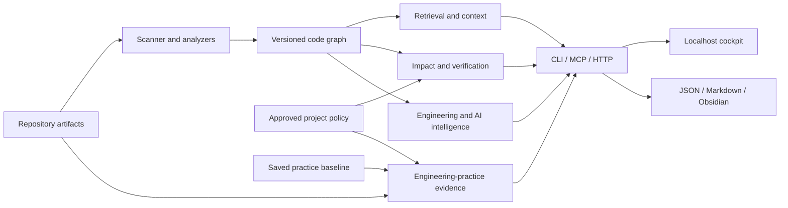

# Architecture and ownership

fehm is a local analysis engine with thin interfaces. Repository facts, inferred risks, human-approved policy, and model-generated output remain distinguishable.

## Data flow



## Module ownership

| Responsibility | Owner |
| --- | --- |
| File discovery, content hashes, language/test detection | `scanner.ts`, `config.ts` |
| Syntax, compiler relationships, polyglot extraction | `analyzer.ts` |
| Graph building, bounded traversal, statistics | `graph.ts`, `model.ts` |
| Index orchestration, persisted cache, invalidation | `indexer.ts` |
| Intent, ranking, context, estimated-token accounting | `context.ts` |
| Diff projection, blast radius, graph comparison | `change.ts` |
| Static checks, project commands, security, dependency contracts | `verification.ts` |
| Architecture proposals and explicit approval | `architecture.ts` |
| Practice catalog, policy, evidence baseline, drift | `engineering-practices.ts` |
| Understanding, protected zones, preflight, fix/verify | `agent-control.ts` |
| Memory, archaeology, hotspots, recommendations | `intelligence.ts` |
| DNA, entry points, flows, explanations, unknowns | `system-map.ts` |
| Readiness, capabilities, onboarding, connectivity, vault export | `project-readiness.ts` |
| Coverage, test selection, quality, mutation and bug replay | `testing-intelligence.ts`, `mutation-testing.ts`, `bug-lifecycle.ts` |
| API/infrastructure/security/dependency/cross-repository analysis | `contract-intelligence.ts`, `security-graph.ts`, `code-risk-intelligence.ts`, `cross-repository.ts` |
| Prompt analysis/history, provider execution, optimization | `prompt-engine.ts`, `prompt-runtime.ts`, `prompt-optimizer.ts`, `semantic-summary.ts` |
| Agent history, mistakes, claims, evaluation analytics | `ai-governance.ts` |
| Git timeline, ADRs, ownership, checkpoints | `history-intelligence.ts` |
| Runtime traces, project discovery, health, universal search | `runtime-intelligence.ts`, `project-intelligence.ts` |
| Atomic file writes and polling synchronization | `persistence.ts`, `synchronizer.ts` |
| CLI, stdio MCP, HTTP, OS service installation | `cli.ts`, `mcp.ts`, `server.ts`, `service-manager.ts` |
| Presentation and user interaction | `public/` |
| Assistant skill registration and preservation | `integrations.ts`, `integrations/fehm/SKILL.md` |
| uv distribution, bundled engine, private runtime launcher | `pyproject.toml`, `hatch_build.py`, `python/fehm/cli.py`, `scripts/package-python.mjs` |

The Python entry point launches the same compiled CLI using the pinned Node runtime supplied by a Python dependency. Analysis remains in TypeScript. Production assets and TypeScript runtime files are prepared at release time; user installation does not execute npm or download code on first launch. On POSIX the launcher replaces itself with Node to preserve signals and stdio. On Windows it uses a child process; process supervisors must stop the process tree when terminating it forcibly.

## The eight architecture answers

1. **What is in the system?** A scanner/analyzer pipeline produces a graph; intelligence and policy engines consume it; interfaces expose their results.
2. **Who owns what?** The table above identifies module responsibilities. Interfaces orchestrate and present; they do not duplicate analysis rules.
3. **Why this design?** Local processing protects source privacy. Deterministic facts and explicit inference support review. Separate policy approval prevents guessed architecture from becoming enforcement.
4. **What may touch what?** Interfaces call engines. Engines consume typed graphs and relevant artifacts. Browser code renders results. Model providers are isolated behind explicitly invoked adapters.
5. **How does data move?** Source → graph → context/review/intelligence → interface. Practice audits also read current non-source artifacts. Mutating workflows persist local state atomically per file.
6. **What must remain invariant?** Keep provenance, report unknowns, preserve the local/default provider boundary, validate approved policy, and never imply standards compliance from static signals.
7. **Where does new code belong?** Extend the module owning the behavior; add thin CLI/API/MCP wiring and meaningful tests. Add practice checks to the catalog with applicability and evidence. Place durable writes behind persistence helpers.
8. **When must an agent stop and ask?** If the requested implementation conflicts with an approved boundary or invariant, STOP. Explain the conflicting rule, affected files and owner, and the smallest compliant alternative before editing.

## Project architecture contracts

Architecture inference creates `.fehm/architecture.proposed.json`. Approval produces `.fehm/architecture.json`. A contract describes layers and dependency rules rather than declaring one globally correct architecture.

```json
{
  "version": 1,
  "layers": [
    { "name": "controller", "patterns": ["src/controllers/**"] },
    { "name": "service", "patterns": ["src/services/**"] },
    { "name": "database", "patterns": ["src/db/**"] }
  ],
  "allowedDependencies": {
    "controller": ["service"],
    "service": ["database"],
    "database": []
  },
  "forbiddenDependencies": [
    { "from": "src/controllers/**", "to": "src/db/**", "reason": "Controllers must use the service layer." }
  ]
}
```

Checks operate on resolved file import edges. Unresolved or dynamic relationships limit coverage. Before/after drift retains individual added, resolved, and unchanged violations; new violations cannot be hidden by an equal number of fixes.

Engineering-practice policy is separate from import policy. Its required controls, documented exemptions, approval hash, and baseline semantics are described in [ENGINEERING_PRACTICES.md](ENGINEERING_PRACTICES.md).

## Extension boundaries

Do not place secret values in findings, infer author identity from code quality, treat static test reachability as measured coverage, or make ordinary analysis contact external model services. Analyzer additions must expose their resolution limitations. Native commands, browser checks, provider tests, and deployment adapters need environment-appropriate verification.

The compiler currently uses fixed TypeScript options; polyglot extraction is shallower. Those are known implementation limits, not proof that the indexed project violates architecture.
